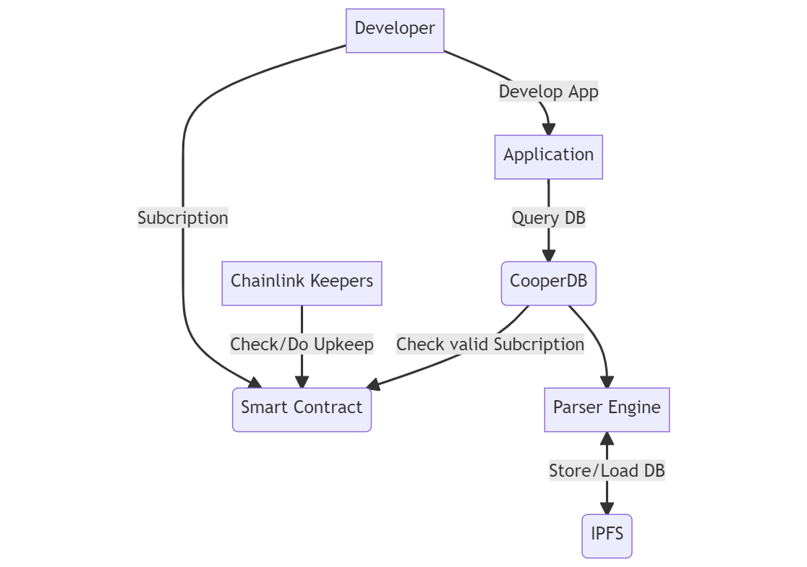

<div id="top"></div>

[![Contributors][contributors-shield]][contributors-url]
[![Forks][forks-shield]][forks-url]
[![Stargazers][stars-shield]][stars-url]
[![Issues][issues-shield]][issues-url]
[![MIT License][license-shield]][license-url]
[![LinkedIn][linkedin-shield]][linkedin-url]


<!-- PROJECT LOGO -->
<br />
<div align="center">
  <a href="https://github.com/IKalonji/CooperDB">
    
  </a>

  <h3 align="center">CooperDB</h3>

  <p align="center">
    Relational Database Management built on top of IPFS/Filecoin and FilSwan MCS. 
    <br />
    <a href="https://github.com/IKalonji/CooperDB/blob/main/README.md"><strong>Explore the docs »</strong></a>
    <br />
    <br />
    <a href="https://youtu.be/pLqrLngBJcg">View Demo</a>
    ·
    <a href="https://github.com/IKalonji/CooperDB/issues">Report Bug</a>
    ·
    <a href="https://github.com/IKalonji/CooperDB/issues">Request Feature</a>
  </p>
</div>

## Inspiration

To onboard more developers into the web3 space we need to provide tools that most developers are familiar with.
Relational databases are the most widely used database option in development of systems and are a very powerful tool
for handling data. 

Although there exist database options on IPFS like OrbitDB which handle key-value stores, we do not have a robust relational database framework in
the web3 space which results in may developers using the traditional web2 database options like MySQL and Postgres.

## Build log

### Web3 Infinity Hackathon
* Built a basic database engine POC

### Data DAO Hackathon
* Developer Console
* Integrate MCS [filswan](https://docs.filswan.com/multi-chain-storage/developer-quickstart/sdk/python-mcs-sdk/get-started)
* Improved the initial Database logic

## Demo Video

#### Current Iteration Demo
[](https://youtu.be/pLqrLngBJcg)
https://youtu.be/pLqrLngBJcg

### First Iteration Demo
[](https://youtu.be/mmEXSMz2a9o)

## How it works



We are working on creating a subset of SQL called CooperQL which will act as a Domain Specific Language for the CooperDB frame work. After every request which changes the state of
the data loaded from IPFS a new commit is done and the CID is updated.

Available database queries for the current iteration:
* create database
* create table
* all CRUD operations on rows
* Joins (inner, outer, left, right)

Example request to create a table (Code is well documents, please browse through for more examples):
```sh
{
    "query": "create_table"
    "database_name": "cooperDB_demo",
    "name": "addresses",
    "columns": [
                    { 
                        "name": "name",
                        "type": "string",
                        "primary_key": True, 
                        "unique": True, 
                        "foreign_key": 
                            {
                                "table": "clients",
                                "column": "name"
                            }
                    },
                ]
}
```

## Built with:

* Python
* FilSwan MCS
* Angular
* Chainlink
* Polygon
* Solidity

## Future developments

* Data encryption
* Make CooperDB open to the public
* Improve CooperQL 
* Handle more complex predicates
* Allow for creation of user defined functions and stored procedures

## Challenges faced

Mainly, creating a Lexer for parsing requests and implementing a Keeper for subscriptions.

## Running the project

### CooperDB Engine

* Requires Python 3.6+
* API KEY from Tatum for IPFS data storage

1. Clone the repo.

```sh
git clone https://github.com/IKalonji/CooperDB.git
```

2. Insert API KEY into ipfs_requests.py.

3. Run test_script.py.

4. Now you can play around with the different functionalities.

### CooperDB Developer Console

1. cd into CooperDB-Management-Console

2. Run npm install

3. Run ng serve --open

## Acknowledgements

* IPFS/Filecoin
* FilSwan
* Encode Club
* Chainlink

## Licenses

The project is open source under the MIT License, please see the license file.

[contributors-shield]: https://img.shields.io/github/contributors/IKalonji/CooperDB.svg?style=for-the-badge
[contributors-url]: https://github.com/IKalonji/CooperDB/graphs/contributors
[forks-shield]: https://img.shields.io/github/forks/IKalonji/CooperDB.svg?style=for-the-badge
[forks-url]: https://github.com/IKalonji/CooperDB/network/members
[stars-shield]: https://img.shields.io/github/stars/IKalonji/CooperDB.svg?style=for-the-badge
[stars-url]: https://github.com/IKalonji/CooperDB/stargazers
[issues-shield]: https://img.shields.io/github/issues/IKalonji/CooperDB.svg?style=for-the-badge
[issues-url]: https://github.com/IKalonji/CooperDB/issues
[license-shield]: https://img.shields.io/github/license/IKalonji/CooperDB.svg?style=for-the-badge
[license-url]: https://github.com/IKalonji/CooperDB/blob/main/LICENSE.txt
[linkedin-shield]: https://img.shields.io/badge/-LinkedIn-black.svg?style=for-the-badge&logo=linkedin&colorB=555
[linkedin-url]: https://www.linkedin.com/in/issa-kalonji-b301851ba/
